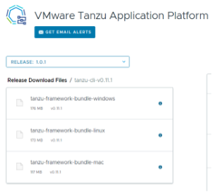
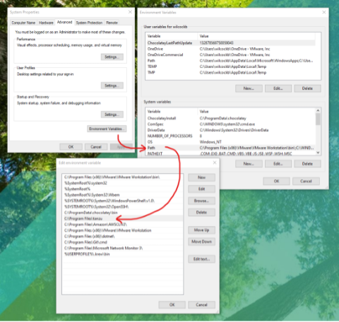

## Introduction 
 
The installation of VMware Tanzu Application Platform (TAP for short) is possibly more involved than some other development tools you’re used to. That’s because TAP is DevOps in a box, with all the functionality you’d expect. Installed on the public cloud or in a data center, TAP brings a fully-featured development platform that can serve the needs of hundreds of developers and operators at the same time. Stick with this tutorial and you’ll gain access to a modern software supply chain, effortless Kubernetes application scheduling, and even serverless computing. Let’s begin! 

{}
These steps have been verified against version 1.0.1 of Tanzu Application platform, the most current at the time of writing (March 2022). The official documentation for Tanzu Application Platform can be found [here](https://docs.vmware.com/en/Tanzu-Application-Platform/1.0/tap/GUID-overview.html). 
{}

## Before You Start 
 
There are a few things you must have ready before you begin your TAP installation: 

* **Hardware**: A PC or Laptop with a modern Intel i7 or AMD Ryzen 7 processor (or better) with at least 8 threads, 16GB of RAM, and 40 GB of disk space. 
* **Operating System**: Windows 10, MacOS (_coming soon_), or Ubuntu 20.04 LTS (_coming soon_) and full administrator access. 
* **Software**: [Minikube]() (a laptop friendly version of Kubernetes which is supported by TAP). [Kubectl](https://kubernetes.io/docs/tasks/tools/) (the command-line tool used to work with Kubernetes). (Windows only ) Hyper-V (The hypervisor we tested with Minikube, which [can be added as a Windows feature](https://docs.microsoft.com/en-us/virtualization/hyper-v-on-windows/quick-start/enable-hyper-v)). 
* **Accounts**: You’ll need the username and password for your [Docker Hub](https://hub.docker.com/) account and the username and password for your account on the [Tanzu Network](https://network.pivotal.io) (registration is free). 
* **Time**: About 1 hour (but this can vary depending on your bandwidth, processor, RAM, etc.). 
* **Connectivity**: A stable broadband connection capable of at least 30 Mb/s download and 10 Mb/s upload. 

## Stage 1: Installing the Tanzu CLI Tool v0.11.1.

This process installs the Tanzu CLI command-line tool that you’ll use to install TAP and interact with it. This guide assumes you have not done this before. If you have installed this version of the tanzu cli before, you can skip this step. The instructions for replacing older versions are in the [TAP documentation](https://docs.vmware.com/en/Tanzu-Application-Platform/1.0/tap/GUID-install-tanzu-cli.html).

First, download the Tanzu CLI from the [Tanzu Application Platform page](https://network.pivotal.io/products/tanzu-application-platform/) on the Tanzu Network. Choose `tanzu-cli-v0.11.1` and then choose the download link for the `tanzu-framework-bundle` binary that matches your operating system (either -windows, -mac, or -linux).



{}
**Note**: You will be asked to agree to the Tanzu Application Platform EULA (the VMware End User License Agreement) in order to download the Tanzu CLI application.
{}

Open a new PowerShell window with administrator privileges, or on macOS or Ubuntu, begin a new Terminal window.  




Click the Windows Start Menu > Right-click Terminal > More > Run as administrator 




    {}
    Coming soon!
    {}




    {}
    Coming soon!
    {}




Next, create a new folder for the Tanzu CLI tool.




    ```sh
    # Create a new home for the Tanzu CLI in "Program Files"
    mkdir "C:\Program Files\tanzu"
    ```




    {}
    Coming soon!
    {}




    {}
    Coming soon!
    {}




1.	Use Windows Search to search for `environment`. 
2.	Select **Edit the system environment variables** to open the System Properties dialogue. 
3.	Click the **Environment Variables** button to open the user and system environment variables dialogue box.
4.	Under the System variables list, find the entry for `PATH` and double click it
5.	Add a new entry for `C:\Program Files\tanzu\tanzu.exe` as shown in the image below.
6.	Click OK.

    

    _Add an environment variable to your system’s `PATH` for the directory where you installed the Tanzu CLI tool._

{< /tab >}}


    {}
    Coming soon!
    {}




    {}
    Coming soon!
    {}


